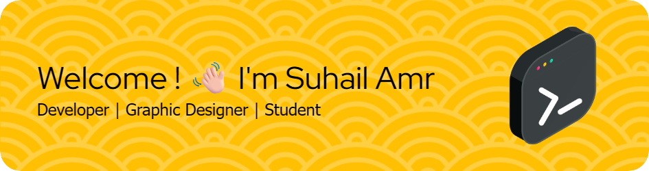

##### The Path we choose depends on how long we feel about it

<!--
**suhailamr/suhailamr** is a ✨ _special_ ✨ repository because its `README.md` (this file) appears on your GitHub profile.

Here are some ideas to get you started:

- 🔭 I’m currently working on ...
- 🌱 I’m currently learning ...
- 👯 I’m looking to collaborate on ...
- 🤔 I’m looking for help with ...
- 💬 Ask me about ...
- 📫 How to reach me: ...
- 😄 Pronouns: ...
- ⚡ Fun fact: ...
-->

I feel energetic to enjoy life, believing that even simple things can spark a fresh start. With a strong passion for technology and creativity, I enjoy combining clean code with thoughtful design to craft meaningful and intuitive web experiences.

*currently learning*
#### Code 💻

#### Office Tools 📊

#### Graphic 📷